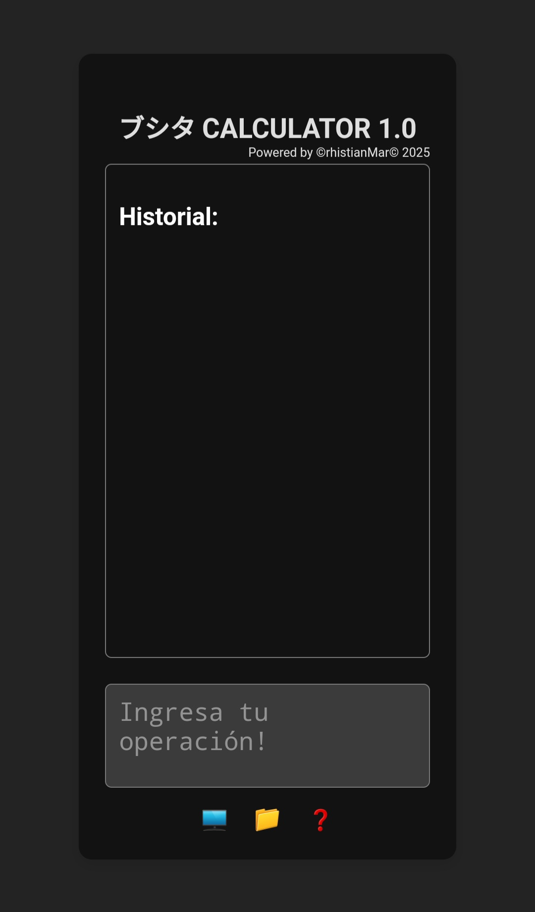

# ブシタ CALCULATOR 1.0

**ブシタ CALCULATOR 1.0** es una calculadora estilo *winchadora* diseñada en HTML. Permite realizar operaciones matemáticas básicas y guarda las operaciones en tiempo real, simulando el efecto de papel continuo.

## Características

- Operaciones matemáticas básicas: suma, resta, multiplicación y división.
- Visualiza y Guarda el historial de operaciones en tiempo real.
- Interfaz sencilla y práctica, inspirada en las calculadoras winchadoras clásicas de escritorio.
- Funciona directamente desde el navegador, sin necesidad de instalación.

## Captura de pantalla

## Cómo usar

1. Descarga el archivo `ブシタ CALCULATOR 1.0.html` desde este repositorio.
2. Ábrelo con cualquier navegador (Chrome, Firefox, Edge, etc.).
3. Empieza a calcular y verás cómo se guarda tu historial automáticamente en pantalla.

## Descargar

Puedes descargar el archivo desde aquí:

[**Descargar ブシタ CALCULATOR 1.0**](./%E3%83%96%E3%82%B7%E3%82%BF%20CALCULATOR%201.0.html)

## Créditos

Desarrollado por **Crhistian Marc**.

---
